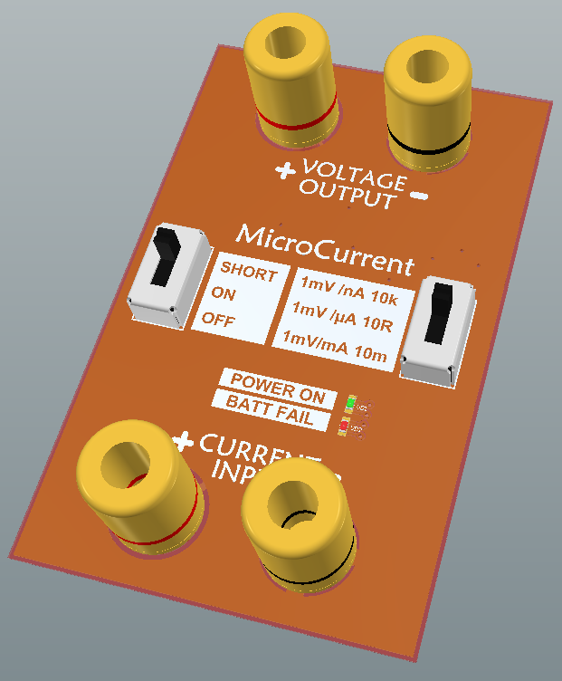
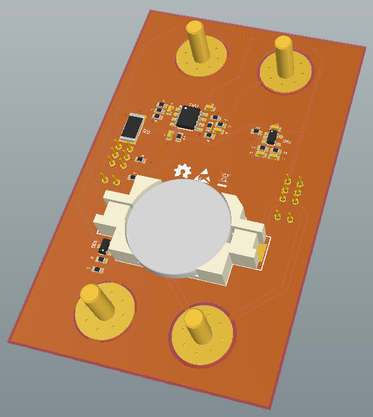

# MicroCurrent – my version of uCurrent Gold

A low cost yet professional low current measurement shunt and amplifier
combination to overcome the issue of high burden voltage as seen with
multimeters and to enable low current measurement by using voltage measurement
devices such as oscilloscopes.

Originally designed and sold by
[Dave Jones on the EEVBLOG](https://www.eevblog.com/projects/ucurrent/). 

I used alternative components that can be found in Russia in online stores like [chipdip](https://www.chipdip.ru) and [AliExpress](https://aliexpress.com/).

## Maximum Ratings

- Maximum supply voltage: 5.5 V
- Maximum current through input ports: 5 A

In order to keep the burden voltage low, this device has no
**OVERLOAD PROTECTION**. That means **NO FUSES**. Care is required in
using the unit to prevent damage.

## Schematics and PCB Design

All source files are [available on Github](https://github.com/ARNik/microcurrent).
The schematics and PCB layout are in Altium Designer format.

## Licenses

### Circuit Schematics

The circuit schematics of this project are made available under the
[CC-BY-SA](https://creativecommons.org/licenses/by-sa/3.0/) license.

### Hardware Design

 Open source hardware.

### Miscellenious

Data sheets, Altium libraries, 3D Models are subject to vendor specific
licensing.
